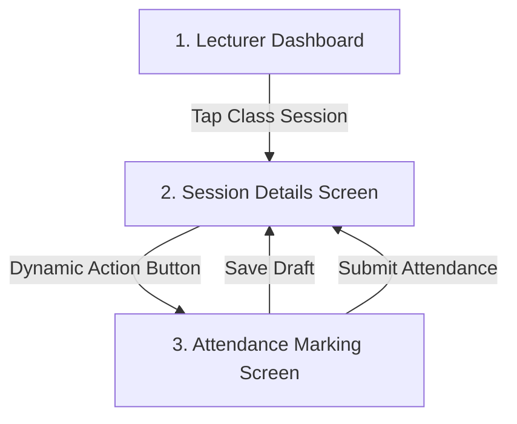

# Lecturer Attendance Marking Module

## 1. Overview

The **Lecturer Attendance Marking Module** enables academic lecturers to record and manage daily attendance sheets directly from their schedules. It features real-time statistic computations, responsive segment controllers, conditional remarks logging, and a defensive dual-mode saving system (Draft vs. Final Submission) with direct Firestore integration.

This module is designed mobile-first, adhering to the clean, professional, and soft visual language of the overall system.

---

## 2. Key User Flows

The lecturer interaction model is divided into three responsive steps:



### 1. Dynamic Action Triggering (`SessionDetailPage`)
When a lecturer navigates to a session detail screen, a sticky `bottomNavigationBar` is dynamically constructed by subscribing to `attendanceRecordProvider`. 
- **No Record Found**: Renders a primary blue **"Mark Attendance"** button.
- **Draft Exists**: Renders an amber **"Resume Draft Attendance"** button showing a preview of current markings (e.g. `3/4 Present (75%)`).
- **Submitted Record Exists**: Renders an emerald **"Edit Attendance (Submitted)"** button.

### 2. High-Fidelity Marking (`AttendanceMarkingPage`)
Tapping any trigger navigates to the marking screen. All students are lazy-initialized from the class enrollment list:
- **Default State**: In a new record, all students default to **Present (P)** to minimize taking time.
- **Resumed State**: If a draft or submission already exists, all markings and custom remarks are populated.

### 3. Verification & Submission
Lecturers can toggle segment selections and edit reasons. 
- **"Save Draft"**: Saves state with `status: "draft"` so it can be resumed later.
- **"Submit Attendance"**: Finalizes the record with `status: "submitted"`, appending a submission timestamp.

---

## 3. Database Schema & Data Models

All attendance data is persisted under the top-level collection `attendance_records`. 

### Document Structure & Models

#### `AttendanceRecordModel`
Represents the main document in Firestore under `attendance_records`.
- **Document ID Strategy**: Deterministic key formatting as `${timetableSessionId}_${attendanceDate}` (e.g. `mock-session-001_2026-05-22`).
- **Fields**:
  - `attendance_record_id`: String
  - `timetable_session_id`: String
  - `attendance_date`: String (Format: `YYYY-MM-DD`)
  - `class_group_id`: String
  - `subject_id`: String
  - `lecturer_id`: String
  - `submitted_by_uid`: String
  - `submitted_at`: Timestamp (Null if saved as Draft)
  - `status`: String (`"draft"` or `"submitted"`)
  - `students`: Array of `AttendanceStudentModel` objects
  - `summary`: `AttendanceSummaryModel` object
  - `created_at`: Timestamp (Server-assigned)
  - `updated_at`: Timestamp (Server-assigned)

#### `AttendanceStudentModel`
Maps the individual state of each enrolled student within the sheet.
- **Fields**:
  - `student_id`: String
  - `status`: String (`"present"` | `"late"` | `"absent"` | `"mc"` | `"ck"`)
  - `remarks`: String (Optional text input logged by the lecturer)

#### `AttendanceSummaryModel`
Holds the computed aggregates stored in Firestore to prevent expensive read-time summaries.
- **Fields**:
  - `total_students`: Integer
  - `present_count`: Integer (Computed as `Present` + `Late` statuses)
  - `absent_count`: Integer
  - `mc_count`: Integer
  - `ck_count`: Integer
  - `attendance_percentage`: Double (`(present_count / total_students) * 100`)

---

## 4. State Management Layer (Riverpod)

The module's reactive data sync is orchestrated by Riverpod providers located in `lib/core/providers/attendance_provider.dart`.

### 1. Dynamic Record Stream
```dart
final attendanceRecordProvider = StreamProvider.family<AttendanceRecordModel?, String>((ref, key) { ... });
```
- **Family Key Structure**: Uses a combined string `"$timetableSessionId|$attendanceDate"` to bypass parameter serialization limits.
- **Stream Binding**: Subscribes to snapshots of the deterministic document ID. Any background or remote update immediately reflects in the UI without manual polling.

### 2. Core Service Layer
```dart
final attendanceServiceProvider = Provider<AttendanceService>((ref) { ... });
```
- Exposes `saveRecord(...)` handling the packaging, validation, live mathematical aggregates, and Firestore atomic writes.
- Implements `SetOptions(merge: true)` to update fields defensively without corrupting indices or audit logs.

---

## 5. User Interface Components

### 1. Dynamic Summary Card Banner
Visible at the top of the entry screen, it translates raw numbers into helpful visual representations:
- **Visual Progress Ring**: A clean circular progress indicator demonstrating the live attendance percentage.
- **Threshold Alarms**: If the rate drops below **`80%`** (`AttendanceRules.warningThresholdPercentage`), the card's background instantly shifts from primary corporate blue to a high-contrast danger red, prompting the lecturer of a potential eligibility issue.
- **Status Tallies**: Shows exact counts of all active statuses (`P:3 L:1 A:0 MC:0 CK:0`).

### 2. Student List & Segments
- **Alpha-sorted cards**: List group automatically sorts students alphabetically by full name.
- **Interactive Segment Buttons**: Sleek, custom-styled rounded row buttons representing P, L, A, MC, CK:
  - **P (Present)**: Emerald Green (`#10B981`)
  - **L (Late)**: Teal (`#14B8A6`)
  - **A (Absent)**: Crimson Red (`#EF4444`)
  - **MC (Medical Certificate)**: Amber Orange (`#F59E0B`)
  - **CK (Cuti Khas / Special Leave)**: Indigo Blue (`#6366F1`)
- **Smart Remarks Fields**: Exposes a subtle helper text field with matching status borders when a status other than `present` is chosen. Prompts the lecturer for necessary notes (e.g. "Traffic delay" or "MC Reference Code").

---

## 6. Defensive Design & Security Rules

### 1. Concurrency & Double-Submit Protection
- Tapping **"Save Draft"** or **"Submit Attendance"** sets an internal page state `_isSaving = true`.
- During write transactions, both action buttons are physically disabled (`onPressed: null`), and the button icons are replaced by loading indicators.
- This UI-level safety lock ensures multi-tapping or laggy networks do not trigger duplicate parallel Firestore writes.

### 2. Duplicate Submission Prevention
- Since the Firestore document ID is constructed deterministically (`timetableSessionId_attendanceDate`), double submissions are structurally impossible. Clicking "Submit" simply overwrites the single existing sheet for that day and class.

### 3. Approved Business Rules
- **Late Status Integration**: Tardy students marked as **Late (L)** count as attended when calculating total present counts and attendance percentages, per `AttendanceRules.lateCountsAsPresent = true`.
- **Cuti Khas Mapping**: The shorthand status **CK** represents **Cuti Khas** (Special Leave), indicating official approved institutional activities or emergencies.
