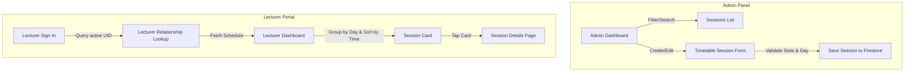

# Timetable Sessions Module

## 1. Overview

The **Timetable Sessions Module** acts as the structural foundation of the MARA Attendance System. It provides administrators with high-fidelity, real-time tools to configure weekly class schedules, and provides lecturers with a chronologically ordered, day-grouped dashboard mapping their specific classes, room assignments, and student enrollments.

This module supports roles for:
- **Admin**: Complete CRUD (Create, Read, Update, Delete) controls to arrange timetable blocks.
- **Lecturer**: Read-only schedule lookup grouped by day of the week, detailing student lists sorted alphabetically.

---

## 2. Core Workflows



### Admin Timetable Configuration Flow
1. **Interactive Listing**: Administrators view all sessions represented inside descriptive, modern cards. Simple filter chips at the top allow immediate filtering by **Class Group** and **Day of Week**.
2. **Form Entry & Validation**: Tapping "Create Session" or "Edit" on a card launches the timetable form. Administrators specify the Class, Subject, Room, Lecturer, Day, and Time Slots via reactive dropdown selectors.
3. **Save/Update**: When saving, the database layer ensures slot durations are logical and resolves potential duplication hazards prior to writing.

### Lecturer Timetable Flow
1. **Dynamic Authentication Query**: Upon sign-in, the system queries the lecturer's profile in Firestore using their Firebase Auth UID (`lecturers` collection where `userUid == authUid`).
2. **Weekly Chronological Calendar**: Displays active weekly schedules grouped under clean weekday dividers (Monday to Sunday) and sorted chronologically by the starting time slot number.
3. **Session Details**: Tapping a session displays descriptive metadata cards and lists enrolled student profiles alphabetically (`A-Z`).

---

## 3. Database Schema & Data Models

All timetable data resides inside Firestore under the top-level collection `timetable_sessions`.

### Document Structure & Models

#### `TimetableSessionModel`
Represents an individual scheduled block inside the `timetable_sessions` collection.
- **Document ID Strategy**: Deterministic key formatting combining core parameters:
  `${classGroupId}_${subjectId}_${lecturerId}_${dayOfWeek}_${startSlotId}_${endSlotId}`
  This layout guarantees that exact matching slots (same group, lecturer, time, and day) overwrite rather than spawning orphan files.
- **Fields**:
  - `timetable_session_id`: String
  - `day_of_week`: Integer (`1` = Monday to `7` = Sunday)
  - `class_group_id`: String
  - `subject_id`: String
  - `lecturer_id`: String
  - `room_id`: String
  - `start_slot_id`: String (TimeSlot document reference)
  - `end_slot_id`: String (TimeSlot document reference)
  - `status`: String (`"active"` | `"inactive"`)

### Reference Metadata Models
To resolve ID relationships into human-readable details, the following collections are read in real-time:
- **`ClassGroupModel`** (`class_groups`): Maps class titles (e.g. `DED1A`) and academic program names.
- **`SubjectModel`** (`subjects`): Connects course codes (e.g. `DED10044`) and course labels.
- **`LecturerModel`** (`lecturers`): Connects institutional identifiers with lecturer names and auth credentials.
- **`RoomModel`** (`rooms`): Lists room names and physical location guides.
- **`TimeSlotModel`** (`time_slots`): Defines standard class slot numbers and precise timing ranges (e.g., `08:00 - 09:00`).
- **`StudentModel`** (`students`): Stores active student profiles mapping their corresponding `class_group_id`.

---

## 4. State Management Layer (Riverpod)

The data streams are constructed inside two dedicated provider scripts:

### 1. Metadata Provider (`lib/core/providers/metadata_provider.dart`)
Orchestrates streams of lookup parameters filtered defensively to select active profiles:
- `classGroupsProvider`: Real-time stream filtering active cohorts.
- `subjectsProvider`: Real-time stream filtering active modules.
- `lecturersProvider`: Real-time stream of lecturers.
- `roomsProvider`: Real-time stream of locations.
- `timeSlotsProvider`: Real-time stream of slot definition units sorted sequentially by `slotNo`.
- `studentsProvider`: Real-time list of students.

### 2. Timetable Provider (`lib/core/providers/timetable_provider.dart`)
Exposes CRUD services and schedule streams:
- `timetableSessionsProvider`: Real-time subscription to the entire `timetable_sessions` collection.
- `TimetableService`: Houses active transaction queries:
  - `saveSession(...)`: Creates or modifies a session record.
    - **Self-Cleaning Key Updates**: If key characteristics are changed (e.g. changing slot times or lecturer ids) which would modify the deterministic ID, the service defensively deletes the old document key prior to writing the new one. This prevents orphan records or duplicate ghost items on the schedule.
  - `deleteSession(sessionId)`: Removes the document instantly.

---

## 5. Visual Components & Layout Guidelines

### 1. Admin Management Dashboard
- **Day and Cohort Filtering**: Visual chips that update the list dynamically to reduce clutter.
- **Dropdown Field Selectors**: Dropdowns query metadata streams on-the-fly and resolve loading parameters safely using spinner states.
- **Administrative Form Validation**: Before saving, the form checks that `startSlot.slotNo <= endSlot.slotNo` and returns descriptive errors directly next to the fields if the schedule spans backward.

### 2. Lecturer Dashboard View
- **Day Section Dividers**: Uses clean, uppercase day header panels (e.g., `MONDAY`, `TUESDAY`) using muted colors to keep focus on class cards.
- **Chronological Time Ordering**: Sessions are dynamically sorted by their starting time slot number, ensuring early morning classes are presented above afternoon ones.
- **Visual Session Cards**: Soft rounded elements carrying high-contrast colored left vertical borders indicating status, class title capsules, subject codes, lecturer display names, time bounds, and room locations.

### 3. Session Student Detail View
- **Course Metadata Header**: A premium white card displaying subject names in dark bold fonts and scheduling information at a glance.
- **Uppercase Count Badges**: Renders an uppercase enrolled count section heading (e.g., `ENROLLED STUDENTS`) with a primary colored pill carrying the live total.
- **Alphabetic Sort Order**: To support convenient taking of attendance, student lists are sorted alphabetically:
  ```dart
  classStudents.sort((a, b) => a.fullName.toLowerCase().compareTo(b.fullName.toLowerCase()));
  ```
- **Active Status Dots**: Every card carries a compact visual indicator mapping active enrollment.
